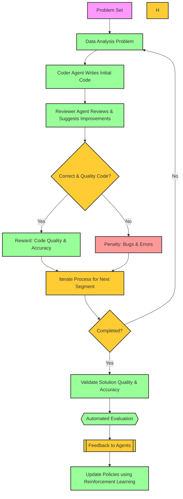

# Agentes Cooperativos para análise de dados

Neste projeto é treinar dois agentes LLM para cooperarem na solução de problemas de análise de dados. O ambiente de treinamento é um ambiente customizado, onde os agentes devem aprender a cooperar para maximizar a recompensa.

Para resolver esta classe de problemas, é necessária dois tipos de agentes: um agente que escreve o código inicial e um agente que revisa e sugere melhorias. O agente revisor deve ser capaz de identificar erros e sugerir melhorias no código. O agente que escreve o código deve ser capaz de corrigir os erros e melhorar o código.

O fluxograma básico do processo é o seguinte:

